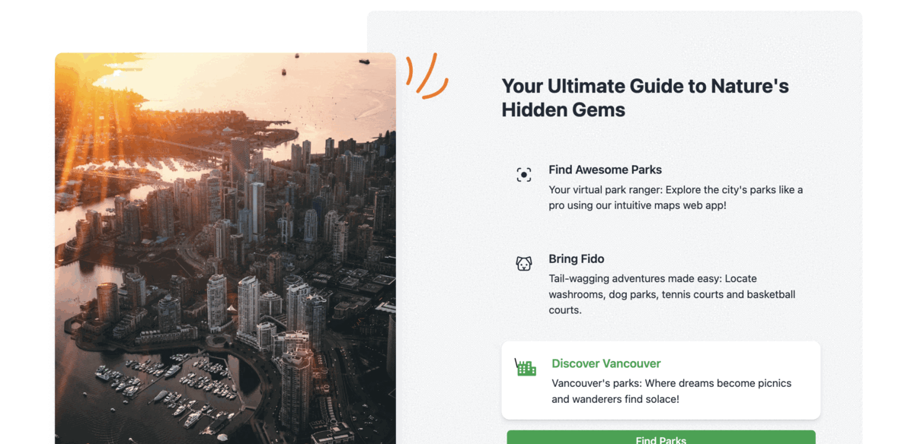

Vancouver Parks Explorer
========================

Welcome to the Vancouver Parks Explorer repository! This project is a React.js web application designed to help users explore and discover parks in Vancouver, along with their amenities such as washrooms, tennis courts, and basketball courts. The app offers a user-friendly interface, responsive design, and seamless integration with various libraries and APIs.

Deployed Version
----------------

The app is deployed on Vercel. You can access it at [Vancouver Parks Explorer](https://map-project-umber.vercel.app/).

Features
--------

*   **Park Locator:** Find parks in Vancouver with ease using our interactive map powered by Leaflet. Pinpoint your desired location and explore the parks in that area.
*   **Amenity Finder:** Locate amenities such as washrooms, tennis courts, and basketball courts within the parks. Discover the facilities available at each park to plan your visit accordingly.
*   **Save Favorites:** Save your favorite parks for quick access in the future. Build your personal collection of go-to parks for picnics, sports activities, or peaceful walks.
*   **Responsive Design:** Experience optimal user interface and functionality across different screen sizes and devices. The app is designed to provide a seamless experience on desktops, tablets, and mobile devices.

Technologies Used
-----------------

*   React.js: A powerful JavaScript library for building user interfaces.
*   Tailwind CSS: A utility-first CSS framework for easy and customizable styling.
*   Preline-UI: A UI component library for React.js, offering ready-to-use components for efficient development.
*   Leaflet: An open-source JavaScript library for interactive maps, providing the foundation for our map functionality.
*   City of Vancouver API: The app utilizes the free API provided by the City of Vancouver to access park data and amenities.

Getting Started
---------------

1.  Clone this repository: `git clone https://github.com/preetsimon/MapProject.git`
2.  Navigate to the project directory: `cd MapProject`
3.  Install the dependencies: `npm install`
4.  Start the development server: `npm run dev`
5.  Access the app in your browser at `http://localhost:5173`

Contributing
------------

We welcome contributions to enhance the Vancouver Parks Explorer app! If you have ideas, suggestions, or bug fixes, please submit a pull request. Be sure to follow our contribution guidelines and code of conduct.

Feedback and Support
--------------------

We value your feedback! If you have any questions, encounter issues, or want to share your experiences with the app, please open an issue on the repository. Our team will be happy to assist you.

Acknowledgments
----------------

We would like to express our gratitude to the City of Vancouver for providing the free API that powers this app. Their commitment to making park information accessible to the public has been instrumental in creating this resource.

License
-------

This project is licensed under the MIT License. Feel free to use, modify, and distribute the code as permitted by the license.

Let's explore Vancouver's parks together!

